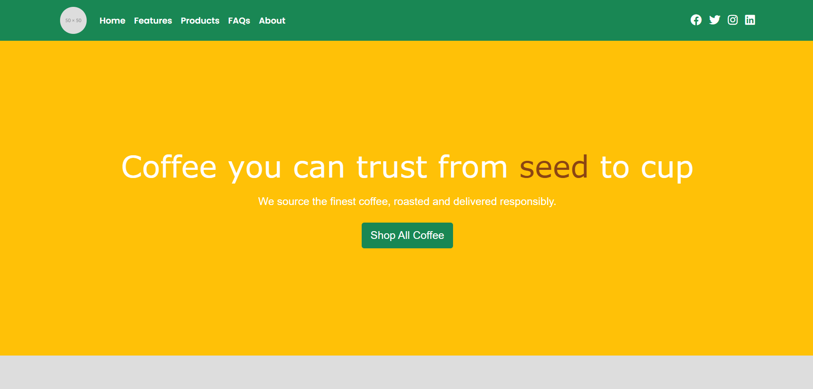

# Coffee WordPress Theme ☕

A modern, responsive, and SEO-friendly **WordPress theme** designed for coffee shops, cafes, and small businesses. Built with **clean code** and **easy customization**, this theme ensures a great user experience.

## 🚀 Features
- ✅ Fully Responsive Design 📱
- ✅ SEO Optimized for Better Ranking 🚀
- ✅ Fast & Lightweight Performance ⚡
- ✅ Customizable via WordPress Customizer 🎨
- ✅ Modern and Minimalist UI ✨
- ✅ Easy Installation & Setup 🔧

## 📥 Installation
1. **Download the Theme**
   - Click on **Code > Download ZIP** or clone the repository.
   
2. **Upload to WordPress**
   - Go to `Appearance > Themes > Add New > Upload Theme`
   - Upload the ZIP file and activate the theme.

3. **Customize the Theme**
   - Navigate to `Appearance > Customize` to modify colors, layout, and more.

## 📷 Screenshots

## 📌 Notes
- All images in this theme are placeholders. Replace them with your own images.
- Supports latest **WordPress** version.

## 🛠️ Contributing
Pull requests are welcome! If you find any issues, feel free to submit an **issue** or **PR**.

## 📄 License
This theme is open-source. You are free to modify and use it as needed.

## 💬 Connect with Me
- 🌐 [Website](eyuptech.com)
- 🔗 [LinkedIn](https://www.linkedin.com/in/ey%C3%BCp-irfan-%C3%A7elik-0652712b8/)

---
_If you like this theme, consider giving it a **star ⭐ on GitHub**!_
